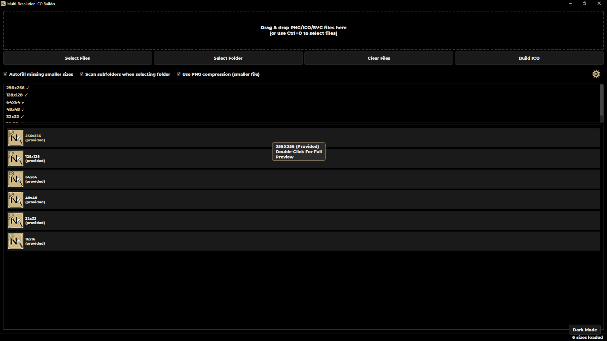
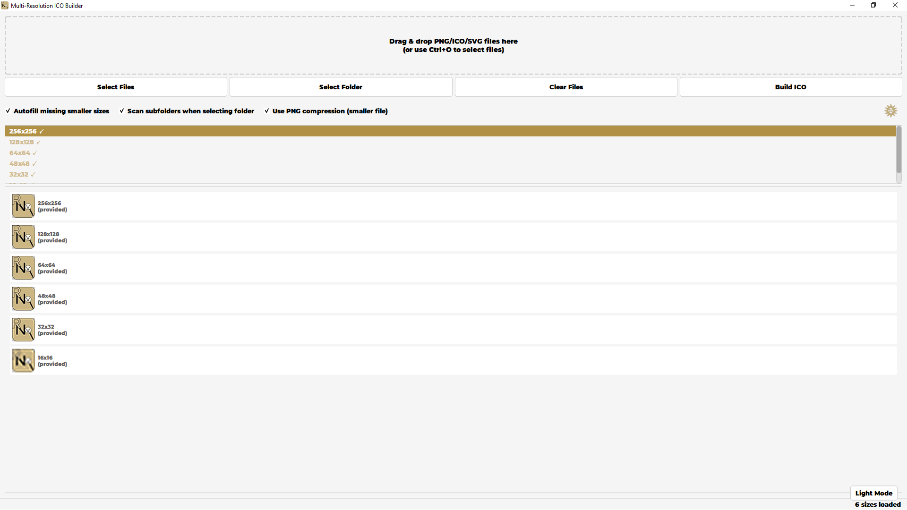
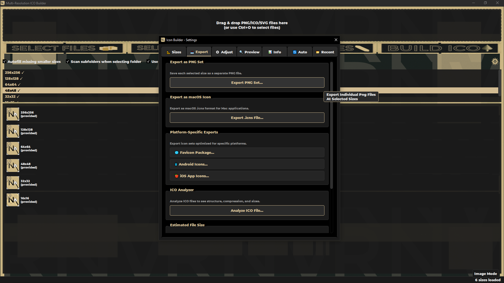
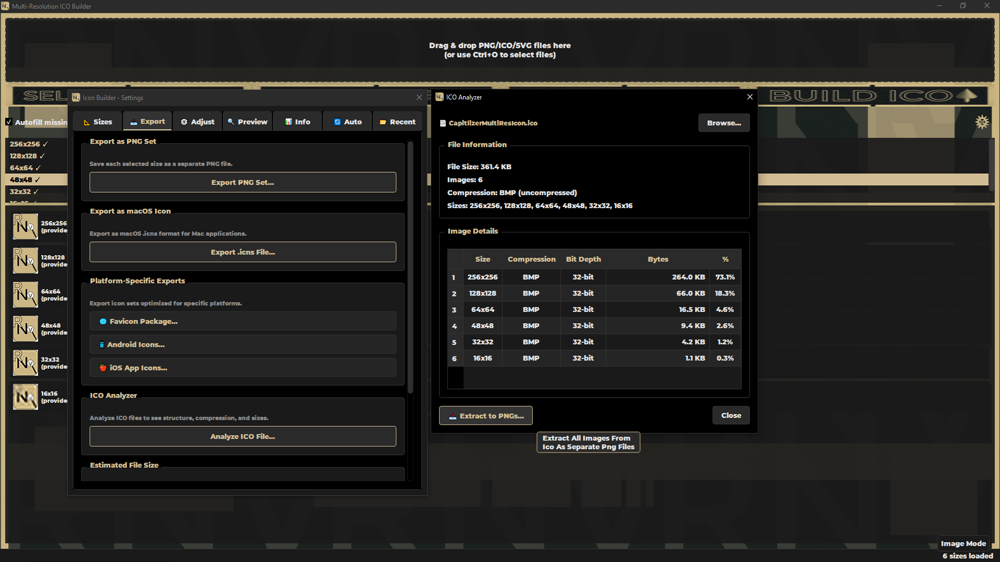
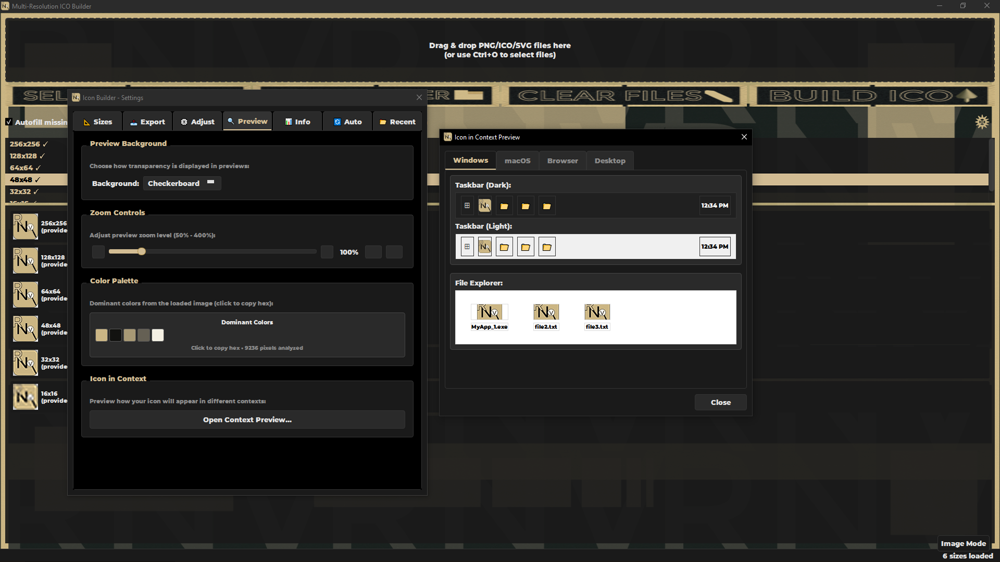

# RNV Icon Builder


[](https://github.com/RNVizion/rnv-icon-builder/actions/workflows/tests-linux.yml)
[](https://github.com/RNVizion/rnv-icon-builder/actions/workflows/tests-windows.yml)

A professional-grade desktop application for creating multi-resolution ICO files from PNG, ICO, and SVG sources. Built with PyQt6 and Pillow, featuring a polished three-theme UI, cross-platform icon exports, batch processing, and a full command-line interface.

> Part of the [RNVizion toolkit](https://github.com/RNVizion) — a suite of professional desktop tools for developers and designers.

## Screenshots








## Features

### Icon Creation
- **Multi-resolution ICO** — Build ICO files with standard sizes (256, 128, 64, 48, 32, 16px)
- **PNG compression** — Smaller files using PNG encoding for large sizes (Vista+)
- **Autofill** — Automatically generate missing smaller sizes from the largest source
- **Smart detection** — Auto-detect image sizes from filenames

### Image Adjustments
- **Transform** — Rotate 90°/180°/270°, flip horizontal/vertical
- **Crop & Resize** — Auto-crop, add padding, center resize
- **Borders** — Colored borders with configurable width
- **Color** — Brightness, contrast, saturation sliders (-100 to +100), grayscale
- **Undo/Redo** — Full 20-state history per size slot

### Export Formats
- **Windows ICO** — Multi-resolution with optional PNG compression
- **macOS ICNS** — Apple icon format with Retina support
- **PNG Set** — Individual PNG files for each size
- **Favicon Package** — Complete web set with ICO, PNGs, and manifest
- **Android Icons** — Mipmap folders (mdpi through xxxhdpi)
- **iOS App Icons** — Complete Assets.xcassets with Contents.json

### Workflow Automation
- **Batch processing** — Queue multiple files for bulk conversion
- **Folder watching** — Monitor a folder and auto-process new images
- **Size presets** — Save and load custom size configurations
- **Project files** — Save complete application state as `.rnvicon` files
- **Session recovery** — Auto-save with crash recovery on startup

### Preview & Analysis
- **Live preview** — All sizes with configurable zoom (50%–400%) and backgrounds
- **Context preview** — See icons in OS mockups (taskbar, folder, browser, dock)
- **ICO analyzer** — Examine existing ICO file structure, extract to PNGs
- **Color palette** — Extract and display dominant colors from loaded images
- **Metadata panel** — File details, dimensions, color mode, DPI

### Themes
- **Dark mode** — Default dark UI
- **Light mode** — Full light theme
- **Image mode** — Background image with translucent panels
- Cycle with `T` key or the theme button

## Installation

### Requirements
- Python 3.10+
- PyQt6
- Pillow

### Setup

Clone the repository and install dependencies:

```bash
git clone https://github.com/RNVizion/rnv-icon-builder.git
cd rnv-icon-builder
pip install -r requirements.txt
```

Or install as an editable package to enable the CLI entry points:

```bash
pip install -e .
```

This exposes two commands globally:

- `rnv-icon-builder` — launch the GUI
- `rnv-icon-cli` — run the command-line interface

### Run

```bash
python RNV_Icon_Builder.py
```

### Building a Standalone Executable

The repository includes platform-specific build scripts that clean caches, remove stale outputs, run PyInstaller, and verify the result.

**Windows:**
```bat
pip install pyinstaller
build_windows.bat
```

**Linux:**
```bash
pip install pyinstaller
chmod +x build_linux.sh   # First time only
./build_linux.sh
```

**Manual (any platform):**
```bash
pyinstaller --clean --noconfirm RNV_Icon_Builder.spec
```

The built executable appears in `dist/`. The included `.spec` file bundles all resources (fonts, button images, background images, and the app icon) into the binary.

## Command-Line Interface

The CLI provides full access to icon building without the GUI:

```bash
# Basic ICO creation
python cli.py input.png -o output.ico

# Custom sizes
python cli.py input.png -o output.ico --sizes 256,48,32,16

# Use a preset
python cli.py input.png -o output.ico --preset favicon

# Batch process a folder
python cli.py folder/ -o icons/ --batch

# Platform exports
python cli.py input.png --favicon-package -o web/
python cli.py input.png --android -o android/
python cli.py input.png --ios -o ios/

# Analyze an existing ICO file
python cli.py app.ico --analyze

# List available presets
python cli.py --list-presets
```

## Keyboard Shortcuts

| Shortcut | Action |
|---|---|
| `Ctrl+O` | Open files |
| `Ctrl+Shift+O` | Open folder |
| `Ctrl+N` | Clear all files |
| `Ctrl+B` | Build ICO |
| `Ctrl+,` | Settings |
| `Ctrl+/` | About |
| `Ctrl+Q` | Quit |
| `T` | Cycle theme |
| `F5` | Refresh preview |
| `F11` | Toggle tooltips |
| `F12` | Toggle debug overlay |

## Project Structure

```
RNV_Icon_Builder/
├── RNV_Icon_Builder.py        # Main application entry point
├── cli.py                     # Command-line interface
├── __init__.py                # Lazy-loader for package/module dual access
├── RNV_Icon_Builder.spec      # PyInstaller build spec
├── pyproject.toml             # Package metadata & entry points
├── requirements.txt           # Runtime dependencies
├── requirements-test.txt      # Test-only dependencies
├── README.md                  # This file
├── LICENSE                    # MIT license
├── .gitignore
├── clean_python_cache.bat     # Windows cache cleanup
├── clean_python_cache.sh      # Unix cache cleanup
├── build_windows.bat          # Windows build (clean + PyInstaller + verify)
├── build_linux.sh             # Linux build (clean + PyInstaller + verify)
│
├── .github/
│   └── workflows/
│       ├── tests-linux.yml    # CI: Ubuntu, Python 3.10–3.13, xvfb
│       └── tests-windows.yml  # CI: Windows, Python 3.10–3.13
│
│   # Test infrastructure (root-level)
├── test_rnv_icon_builder.py   # Legacy unittest suite (471 tests)
├── run_tests.py               # Dual-suite runner (unittest + pytest + coverage)
├── pytest.ini                 # pytest configuration
├── setup.cfg                  # mutmut mutation-testing config
├── .coveragerc                # coverage.py config (branch mode, parallel)
├── sitecustomize.py           # Subprocess-coverage bootstrap shim
├── TEST_SYSTEM.md             # Test architecture reference
│
├── core/
│   ├── __init__.py
│   ├── py.typed               # PEP 561 type-hint marker
│   ├── icon_builder_core.py   # ICO generation, format exports
│   ├── image_processor.py     # Image loading, validation, undo/redo
│   ├── batch_processor.py     # Batch file processing queue
│   ├── folder_watcher.py      # Auto-process watched folders
│   ├── preset_manager.py      # Size preset management
│   ├── project_manager.py     # .rnvicon project files
│   ├── recent_files.py        # Recent file/folder history
│   ├── session_manager.py     # Auto-save and crash recovery
│   └── export_history.py      # Export log with timestamps
├── ui/
│   ├── __init__.py
│   ├── py.typed
│   ├── base_dialog.py         # Base dialog with signal/move mixins
│   ├── colors.py              # Brand colors, theme palettes
│   ├── theme_manager.py       # Dark/Light/Image theme cycling
│   ├── settings_dialog.py     # Tabbed settings (Sizes, Export, Adjust, etc.)
│   ├── about_dialog.py        # About dialog with features and shortcuts
│   ├── preview_utils.py       # Checkerboard, zoom, color palette widgets
│   ├── context_preview.py     # OS context mockup previews
│   ├── ico_analyzer.py        # ICO file analysis dialog
│   ├── metadata_panel.py      # Image metadata display
│   ├── image_adjustments.py   # Transform and color adjustment functions
│   └── debug_button.py        # Developer debug info
├── utils/
│   ├── __init__.py
│   ├── py.typed
│   ├── config.py              # Constants, paths, feature flags
│   ├── logger.py              # Colored console + file logging
│   ├── error_handler.py       # Centralized error handling
│   ├── dialog_helper.py       # Themed message dialog helpers
│   ├── file_utils.py          # File I/O utilities
│   ├── font_loader.py         # Custom font loading with fallback
│   ├── pixmap_cache.py        # QPixmap caching layer
│   ├── signal_manager.py      # Qt signal connection tracking
│   └── async_file_ops.py      # Non-blocking file operations
├── tests/
│   ├── conftest.py            # Shared fixtures + Qt/font/theme bootstrapping
│   ├── snapshots.json         # Syrupy snapshot baselines
│   ├── test_application.py    # Main window lifecycle, theme, public API
│   ├── test_benchmarks.py     # pytest-benchmark performance tests
│   ├── test_cli.py            # CLI subprocess tests (parallel-mode coverage)
│   ├── test_error_handler.py  # Error handler & validation
│   ├── test_folder_watcher.py # Folder watcher behaviors
│   ├── test_image_processor.py
│   ├── test_main_window.py    # Window callbacks, signals, drag/drop
│   ├── test_managers.py       # Preset, recent files, project, export history
│   ├── test_preview_utils.py  # Checkerboard, compositing, color extraction
│   ├── test_properties.py     # Hypothesis property-based tests
│   ├── test_settings_dialog.py
│   ├── test_snapshots.py      # Syrupy structural snapshots
│   ├── test_ui_interactions.py
│   ├── test_utilities.py      # Signal mgr, font loader, session save/load
│   └── test_workers.py        # Batch processor & folder watcher signals
├── docs/
│   └── INTERNALS.md           # Architectural reference
└── resources/
    ├── button_images/          # Button state images (base, hover, pressed)
    ├── background_images/      # Image mode background
    ├── fonts/                  # Embedded Montserrat font
    ├── icons/                  # Application icon
    └── screenshots/            # Project screenshots for README
```

## Testing

The project ships with two complementary test suites totaling **896 tests** with **70.21% branch coverage** across all source modules. Run both via the unified runner:

```bash
python run_tests.py            # Run unittest + pytest + coverage report
python run_tests.py --summary  # Compact one-line per module
python run_tests.py --html     # Also generate htmlcov/ report
python run_tests.py --report   # Re-render report from existing data (no re-run)
python run_tests.py --benchmark # Run pytest-benchmark suite only
```

### Test Suite Composition

| Suite | Location | Count | Purpose |
|---|---|---:|---|
| Legacy unittest | `test_rnv_icon_builder.py` | 471 | Original test suite, run via `unittest` |
| pytest | `tests/` | 425 | Modern fixtures, qtbot, hypothesis, subprocess, snapshots |

The pytest suite includes property-based tests (Hypothesis), structural snapshot tests (Syrupy), performance benchmarks (pytest-benchmark), and subprocess-isolated CLI tests that participate in coverage via a `sitecustomize.py` bootstrap.

### Running Suites Individually

```bash
python -m unittest test_rnv_icon_builder       # unittest only
python -m pytest tests/                        # pytest only
python -m pytest tests/ -v                     # verbose
python -m pytest tests/ -m integration         # integration-marked tests
python -m pytest tests/ --benchmark-only       # benchmarks only
```

### Test Dependencies

Install test-only dependencies separately:

```bash
pip install -r requirements-test.txt
```

This pulls in `pytest`, `pytest-qt`, `pytest-cov`, `pytest-benchmark`, `pytest-timeout`, `hypothesis`, `syrupy`, `coverage`, and `mutmut`.

### Mutation Testing

Configured in `setup.cfg` for use with `mutmut`:

```bash
mutmut run          # Run mutation testing (slow — intended for overnight)
mutmut results      # View summary
mutmut html         # Generate HTML report
```

### Coverage Reports

Coverage data lives in `.coverage` (canonical) plus parallel-mode subprocess files merged automatically at the end of each run. The HTML report renders to `htmlcov/index.html`.

## Documentation

- **[docs/INTERNALS.md](docs/INTERNALS.md)** — Architectural reference covering package structure, ICO format implementation, `.rnvicon` project files, theme system, signal management, and design decisions
- **[TEST_SYSTEM.md](TEST_SYSTEM.md)** — Test architecture: runner internals, fixture system, subprocess coverage, parallel-mode merging

## Tech Stack

- **Python 3.10+** — Modern syntax with type hints throughout
- **PyQt6** — UI framework with Fusion style for cross-platform consistency
- **Pillow** — Image processing and format conversion
- **Custom ICO encoder** — Direct binary ICO generation with PNG compression
- **pytest + Hypothesis + Syrupy** — Property-based, snapshot, and benchmark testing
- **coverage.py** — Branch coverage with parallel-mode subprocess tracking
- **mutmut** — Mutation testing for assertion strength validation

## License

[MIT](LICENSE)

## Author

Built by [RNVizion](https://github.com/RNVizion)
